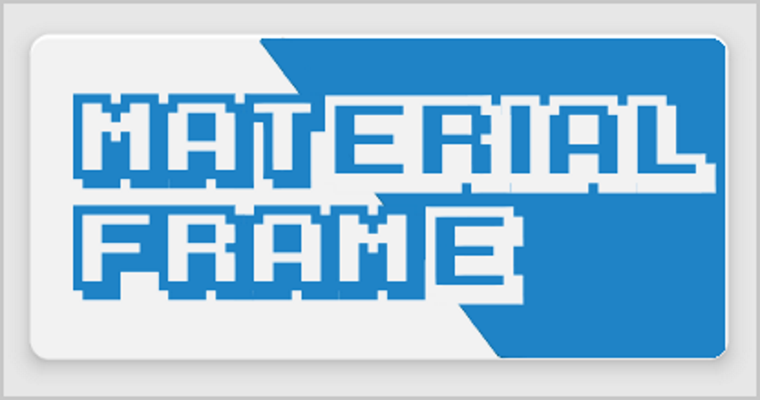
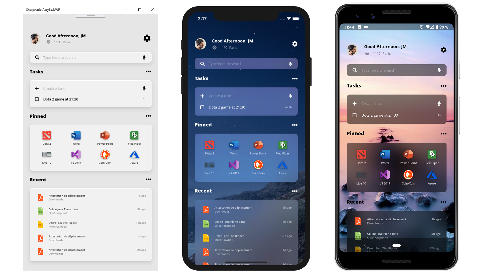

# Sharpnado.MaterialFrame.Maui

<p align="left">

Get it from NuGet:

[](https://www.nuget.org/packages/Sharpnado.MaterialFrame)

| Supported platforms        |
|----------------------------|
| :heavy_check_mark: Android | 
| :heavy_check_mark: iOS     |




## Initialization

* On Core project in `MauiProgram.cs`:

For the namespace xaml schema to work (remove duplicates xml namespace: [see this xamarin doc](https://docs.microsoft.com/en-us/xamarin/xamarin-forms/xaml/custom-namespace-schemas)), you need to call tabs and shadows initializers from the `App.xaml.cs` file like this:

```csharp
public static MauiApp CreateMauiApp()
{

var builder = MauiApp.CreateBuilder();
		builder
			.UseMauiApp<App>()
     .UseSharpnadoMaterialFrame(false)
    ...
}
```


